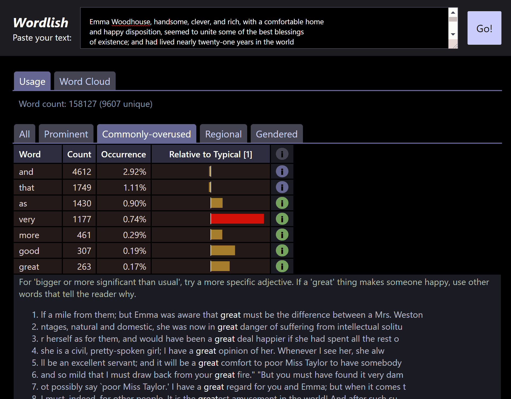

# Wordlish
Wordlish is a handy analysis tool for writers and editors.
Currently hosted at http://johnvalentine.co.uk/app/wordlish/app.html

Use Wordlish to analyse text in your browser. Learn about:
* possible word over-use,
* gender use and balance,
* words that are particular to some locales an not others (US/UK),
* filter words, which can remove your reader from the action.

# Future direction

Free and open source software can go anywhere in future.
- I (the author) wrote Wordlish to be fast, and do everything at the client browser without sending text to a server. On an old laptop, Wordlish reports on _War and Peace_ in a quarter of a second.
- We're looking for other groups of words that writers might want to think about using carefully or not using at all.

# Example

This is an analysis of Jane Austen's 1815 novel *Emma*.

